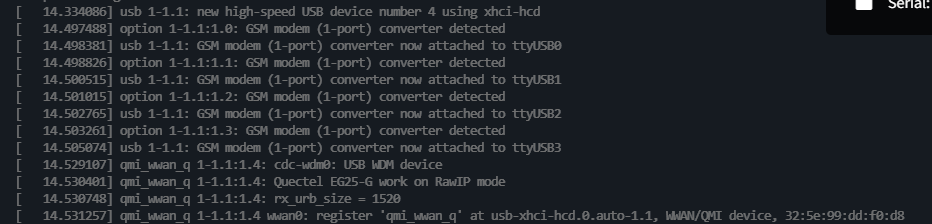
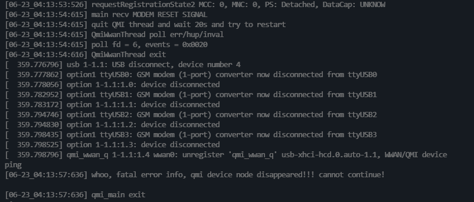
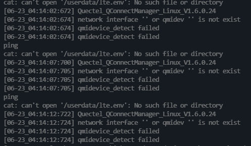
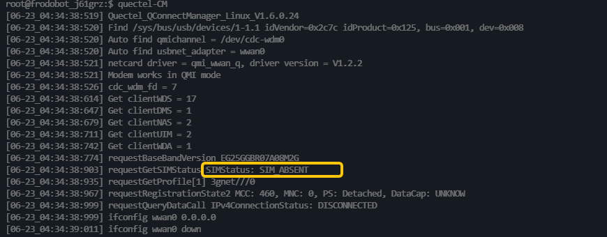

# 06-1 4G模组入网与退网

1. **检查模组插入状态**

   1. 开机过程中出现下方日志证明4G模组正确插入

      

   2. 出现下方日志证明4G模组被中途拔出，需要检查。

      

   3. 运行过程中出现下列日志说明4G模组未正确插入。

      

2. **注网程序**

   > quectel-CM 是移远官方提供用来拨号注网的程序

   1. 自启动脚本

      > quectel.sh 自启动脚本用做参数化开机启动和保活quectel-CM 入网程序

      

   2. quectel-CM 参数介绍

      ```shell
      [06-23_04:32:27:609] Quectel_QConnectManager_Linux_V1.6.0.24
      [06-23_04:32:27:609] Usage: quectel-CM [options]
      [06-23_04:32:27:609] -s [apn [user password auth]]          Set apn/user/password/auth get from your network provider. auth: 1~pap, 2~chap
      [06-23_04:32:27:609] -p pincode                             Verify sim card pin if sim card is locked
      [06-23_04:32:27:609] -p [quectel-][qmi|mbim]-proxy          Request to use proxy
      [06-23_04:32:27:609] -f logfilename                         Save log message of this program to file
      [06-23_04:32:27:609] -u usbmonlog filename                  Save usbmon log to file
      [06-23_04:32:27:609] -i interface                           Specify which network interface to setup data call when multi-modems exits
      [06-23_04:32:27:609] -4                                     Setup IPv4 data call (default)
      [06-23_04:32:27:609] -6                                     Setup IPv6 data call
      [06-23_04:32:27:609] -n pdn                                 Specify which pdn to setup data call (default 1 for QMI, 0 for MBIM)
      [06-23_04:32:27:609] -k pdn                                 Specify which pdn to hangup data call (by send SIGINT to 'quectel-CM -n pdn')
      [06-23_04:32:27:609] -m iface-idx                           Bind QMI data call to wwan0_<iface idx> when QMAP used. E.g '-n 7 -m 1' bind pdn-7 data call to wwan0_1
      [06-23_04:32:27:609] -b                                     Enable network interface bridge function (default 0)
      [06-23_04:32:27:609] -v                                     Verbose log mode, for debug purpose.
      [06-23_04:32:27:609] [Examples]
      [06-23_04:32:27:610] Example 1: quectel-CM 
      [06-23_04:32:27:610] Example 2: quectel-CM -s 3gnet 
      [06-23_04:32:27:610] Example 3: quectel-CM -s 3gnet carl 1234 1 -p 1234 -f gobinet_log.txt
      ```

      

   3. SIM卡插入状态

      1. SIM 卡未插入

         

   4. 查看联网状态

3. 退网