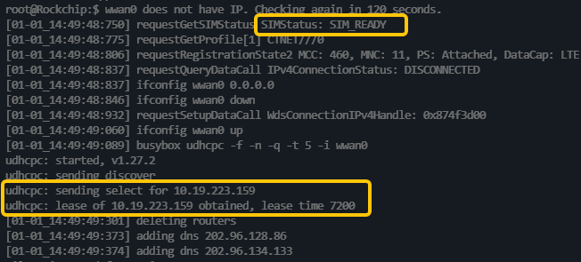

# 06-1 4G模组入网与退网

1. **检查模组插入状态**

   1. 开机过程中出现或者输入 dmesg 指令查看，出现下方日志证明4G模组正确插入

      ```shell
      [  378.744099] usb 1-1.1: new high-speed USB device number 5 using xhci-hcd
      [  378.913481] option 1-1.1:1.0: GSM modem (1-port) converter detected
      [  378.914580] usb 1-1.1: GSM modem (1-port) converter now attached to ttyUSB0
      [  378.915026] option 1-1.1:1.1: GSM modem (1-port) converter detected
      [  378.916713] usb 1-1.1: GSM modem (1-port) converter now attached to ttyUSB1
      [  378.917208] option 1-1.1:1.2: GSM modem (1-port) converter detected
      [  378.918934] usb 1-1.1: GSM modem (1-port) converter now attached to ttyUSB2
      [  378.919423] option 1-1.1:1.3: GSM modem (1-port) converter detected
      [  378.921144] usb 1-1.1: GSM modem (1-port) converter now attached to ttyUSB3
      [  378.945926] qmi_wwan_q 1-1.1:1.4: cdc-wdm0: USB WDM device
      [  378.947713] qmi_wwan_q 1-1.1:1.4: Quectel EG25-G work on RawIP mode
      [  378.948779] qmi_wwan_q 1-1.1:1.4: rx_urb_size = 1520
      [  378.949272] qmi_wwan_q 1-1.1:1.4 wwan0: register 'qmi_wwan_q' at usb-xhci-hcd.0.auto-1.1, WWAN/QMI device, a6:02:08:ff:40:7d
      ```

      

   2. 出现下方日志证明4G模组被中途拔出，需要检查。

      ```shell
      [  364.896693] usb 1-1.1: USB disconnect, device number 4
      [  364.897175] option1 ttyUSB0: GSM modem (1-port) converter now disconnected from ttyUSB0
      [  364.897251] option 1-1.1:1.0: device disconnected
      [  364.899374] option1 ttyUSB1: GSM modem (1-port) converter now disconnected from ttyUSB1
      [  364.899462] option 1-1.1:1.1: device disconnected
      [  364.899932] option1 ttyUSB2: GSM modem (1-port) converter now disconnected from ttyUSB2
      [  364.900006] option 1-1.1:1.2: device disconnected
      [  364.900819] option1 ttyUSB3: GSM modem (1-port) converter now disconnected from ttyUSB3
      [  364.900908] option 1-1.1:1.3: device disconnected
      [  364.901168] qmi_wwan_q 1-1.1:1.4 wwan0: unregister 'qmi_wwan_q' usb-xhci-hcd.0.auto-1.1, WWAN/QMI device
      ```

      

   3. 运行过程中出现下列日志说明4G模组未正确插入。

      ```shell
      [06-23_07:12:26:076] Quectel_QConnectManager_Linux_V1.6.0.24
      [06-23_07:12:26:078] network interface '' or qmidev '' is not exist
      [06-23_07:12:26:078] qmidevice_detect failed
      [06-23_07:12:26:078] qmidevice_detect failed
      ```

      

2. **注网程序**

   > quectel-CM 是移远官方提供用来拨号注网的程序，系统会自动运行拨号程序，如果需要手动尝试，请先停止掉启动脚本和quectel-CM拨号程序

   1. 自启动脚本

      > quectel.sh 自启动脚本用做参数化开机启动和保活quectel-CM 入网程序

      ```shell
      root@frodobot_j61grz:$ cat /usr/bin/quectel.sh 
      #!/bin/sh
      
      while true; do
        ARGS=$(cat /userdata/lte.env)
        /usr/bin/quectel-CM $ARGS
        sleep 5
      done
      ```

      

   2. quectel-CM 参数介绍

      > 通常在国内无需设置任何运行参数，直接运行quectel-CM 进程即可。

      ```shell
      [06-23_04:32:27:609] Quectel_QConnectManager_Linux_V1.6.0.24
      [06-23_04:32:27:609] Usage: quectel-CM [options]
      [06-23_04:32:27:609] -s [apn [user password auth]]          Set apn/user/password/auth get from your network provider. auth: 1~pap, 2~chap
      [06-23_04:32:27:609] -p pincode                             Verify sim card pin if sim card is locked
      [06-23_04:32:27:609] -p [quectel-][qmi|mbim]-proxy          Request to use proxy
      [06-23_04:32:27:609] -f logfilename                         Save log message of this program to file
      [06-23_04:32:27:609] -u usbmonlog filename                  Save usbmon log to file
      [06-23_04:32:27:609] -i interface                           Specify which network interface to setup data call when multi-modems exits
      [06-23_04:32:27:609] -4                                     Setup IPv4 data call (default)
      [06-23_04:32:27:609] -6                                     Setup IPv6 data call
      [06-23_04:32:27:609] -n pdn                                 Specify which pdn to setup data call (default 1 for QMI, 0 for MBIM)
      [06-23_04:32:27:609] -k pdn                                 Specify which pdn to hangup data call (by send SIGINT to 'quectel-CM -n pdn')
      [06-23_04:32:27:609] -m iface-idx                           Bind QMI data call to wwan0_<iface idx> when QMAP used. E.g '-n 7 -m 1' bind pdn-7 data call to wwan0_1
      [06-23_04:32:27:609] -b                                     Enable network interface bridge function (default 0)
      [06-23_04:32:27:609] -v                                     Verbose log mode, for debug purpose.
      [06-23_04:32:27:609] [Examples]
      [06-23_04:32:27:610] Example 1: quectel-CM 
      [06-23_04:32:27:610] Example 2: quectel-CM -s 3gnet 
      [06-23_04:32:27:610] Example 3: quectel-CM -s 3gnet carl 1234 1 -p 1234 -f gobinet_log.txt
      ```

      

   3. SIM卡插入状态

      1. SIM 卡未插入 (SIMStatus : SIM_ABSENT)

         ```shell
         [01-01_15:09:17:488] Get clientWDS = 17
         [01-01_15:09:17:531] Get clientDMS = 1
         [01-01_15:09:17:554] Get clientNAS = 2
         [01-01_15:09:17:581] Get clientUIM = 2
         [01-01_15:09:17:620] Get clientWDA = 1
         [01-01_15:09:17:649] requestBaseBandVersion EG25GGBR07A08M2G
         [01-01_15:09:17:779] requestGetSIMStatus SIMStatus: SIM_ABSENT
         [01-01_15:09:17:808] requestGetProfile[1] CTNET///0
         [01-01_15:09:17:848] requestRegistrationState2 MCC: 0, MNC: 0, PS: Detached, DataCap: UNKNOW
         [01-01_15:09:17:869] requestQueryDataCall IPv4ConnectionStatus: DISCONNECTED
         [01-01_15:09:17:869] ifconfig wwan0 0.0.0.0
         [01-01_15:09:17:908] ifconfig wwan0 down
         ```

         

      2. SIM卡插入，拨号入网成功

         

         > **注意如果拨号成功仍然不能上网（使用ping 命令测试联网结果），则可能是SIM卡欠费或者流量异常。

         ``` shell
         ping frodobots.ai
         ```

         

   4. 查看联网状态

      * p2p0 为机器热点的固定IP地址。
      * wlan0 是机器的WIFI 网卡，成功连接路由器后在inet addr 一栏会得到一个点分十进制的局域网IP地址。
      * wwan0 是4G网卡，成功连接基站后在inet addr 一栏会得到一个点分十进制的局域网IP地址。

      ```shell
      root@frodobot_j61grz:$ ifconfig
      lo        Link encap:Local Loopback  
                inet addr:127.0.0.1  Mask:255.0.0.0
                UP LOOPBACK RUNNING  MTU:65536  Metric:1
                RX packets:0 errors:0 dropped:0 overruns:0 frame:0
                TX packets:0 errors:0 dropped:0 overruns:0 carrier:0
                collisions:0 txqueuelen:1000 
                RX bytes:0 (0.0 B)  TX bytes:0 (0.0 B)
      
      p2p0      Link encap:Ethernet  HWaddr A6:E8:8D:D9:9B:26  
                inet addr:192.168.11.1  Bcast:192.168.11.255  Mask:255.255.255.0
                UP BROADCAST RUNNING MULTICAST  MTU:1500  Metric:1
                RX packets:0 errors:0 dropped:0 overruns:0 frame:0
                TX packets:0 errors:0 dropped:0 overruns:0 carrier:0
                collisions:0 txqueuelen:1000 
                RX bytes:0 (0.0 B)  TX bytes:0 (0.0 B)
      
      wlan0     Link encap:Ethernet  HWaddr A4:E8:8D:D9:9B:26  
                inet addr:192.168.1.41  Bcast:192.168.1.255  Mask:255.255.255.0
                UP BROADCAST MULTICAST  MTU:1500  Metric:1
                RX packets:1323 errors:0 dropped:790 overruns:0 frame:0
                TX packets:95 errors:0 dropped:0 overruns:0 carrier:0
                collisions:0 txqueuelen:1000 
                RX bytes:190031 (185.5 KiB)  TX bytes:24235 (23.6 KiB)
      
      wwan0     Link encap:Ethernet  HWaddr A6:02:08:FF:40:7D  
                inet addr:10.7.189.65  Mask:255.255.255.252
                UP RUNNING NOARP  MTU:1500  Metric:1
                RX packets:2 errors:0 dropped:0 overruns:0 frame:0
                TX packets:2 errors:0 dropped:0 overruns:0 carrier:0
                collisions:0 txqueuelen:1000 
                RX bytes:612 (612.0 B)  TX bytes:656 (656.0 B)
      ```

      

3. 退网

   > 输入指令

   ```shell
   killall quectel.sh && killall quectel-CM
   或者是
   killall quectel.sh && ifconfig wwan0 down
   ```

   