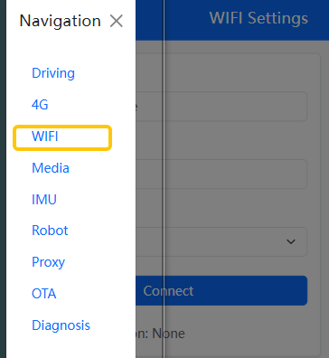
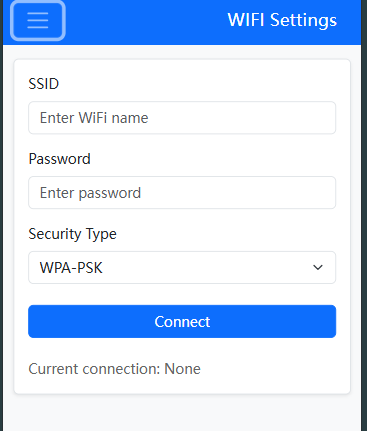

# 06-2 WIFI 模组入网

## 1  使用机器网页配网

* 手机连接机器热点(名称为 frodobot_xx)
* 打开手机浏览器进入网页 192.168.11.1

​	

* 输入SSID 和 PSK , 点击连接，15秒内应该建立WIFI连接

  > 如果是开放式WIFI，无需填写密码, Security Type 选择NONE

​	

## 2  手动修改WIFI 配置使用wpa_supplicant 工具配网

* 编辑配置文件

```shell
root@frodobot_j61grz:$ cat /userdata/wpa_supplicant.conf 
ctrl_interface=/var/run/wpa_supplicant
update_config=1
network={
    ssid="Frodobots"
    psk="11223344"
    key_mgmt=WPA-PSK
}
//如果是开放式WIFI, 密码不需要填写，key_mgmt=NONE
```

* 使用wpa_supplicant 工具连接WIFI

  > 连接前确保wpa_supplicant 进程没有在后台运行，如果有需要先停止掉wpa_supplicant 进程

```shell
killall wpa_supplicant
wpa_supplicant -B -iwlan0 -c /userdata/wpa_supplicant.conf
```

```shell
root@frodobot_j61grz:$ wpa_supplicant -B -iwlan0 -c /userdata/wpa_supplicant.con
f
Successfully initialized wpa_supplicant
rfkill: Cannot open RFKILL control device
root@frodobot_j61grz:$ wwan0 does not have IP. Checking again in 120 seconds.
[ 2301.645190] RTW: wlan0- hw port(1) mac_addr =a4:e8:8d:d9:9b:26
[ 2301.645471] RTW: p2p0- hw port(0) mac_addr =a6:e8:8d:d9:9b:26
[ 2301.661688] ========== ACS (VER-3) ==========
[ 2301.661715] Best 24G Channel:9
[ 2301.661728] Best 5G Channel:52
[ 2301.661728] 
[ 2301.669197] RTW: rtw_set_802_11_connect(wlan0)  fw_state=0x00000008
[ 2301.881953] RTW: start auth
[ 2301.885685] RTW: auth success, start assoc
[ 2301.904620] RTW: assoc success
[ 2301.910577] RTW: ============ STA [68:1b:ef:55:2a:20]  ===================
[ 2301.910618] RTW: mac_id : 2
[ 2301.910637] RTW: wireless_mode : 0x23
[ 2301.910655] RTW: mimo_type : 0
[ 2301.910672] RTW: static smps : N
[ 2301.910692] RTW: bw_mode : 20MHz, ra_bw_mode : 20MHz
[ 2301.910711] RTW: rate_id : 18
[ 2301.910730] RTW: rssi : -1 (%), rssi_level : 0
[ 2301.910750] RTW: is_support_sgi : Y, is_vht_enable : Y
[ 2301.910770] RTW: disable_ra : N, disable_pt : N
[ 2301.910788] RTW: is_noisy : N
[ 2301.910804] RTW: txrx_state : 0
[ 2301.910823] RTW: curr_tx_rate : CCK_1M (L)
[ 2301.910841] RTW: curr_tx_bw : 20MHz
[ 2301.910858] RTW: curr_retry_ratio : 0
[ 2301.910875] RTW: ra_mask : 0x00000000003fffff
[ 2301.910875] 
[ 2301.974511] RTW: recv eapol packet 1/4
[ 2301.976197] RTW: send eapol packet 2/4
[ 2302.015994] RTW: recv eapol packet 3/4
[ 2302.017327] RTW: send eapol packet 4/4
[ 2302.019276] RTW: set pairwise key camid:2, addr:68:1b:ef:55:2a:20, kid:0, type:AES
[ 2302.023181] RTW: set group key camid:3, addr:68:1b:ef:55:2a:20, kid:2, type:AES
```

* 使用udhcpc 工具获取IP地址

```shell
udhcpc -i wlan0
```

```shell
root@frodobot_j61grz:$ udhcpc -i wlan0
udhcpc: started, v1.27.2
udhcpc: sending discover

udhcpc: sending select for 192.168.1.41
udhcpc: lease of 192.168.1.41 obtained, lease time 259200
deleting routers
adding dns 192.168.1.1
```

## 3  断开WIFI网络

* 方式1 停止WIFI网卡

  ```shell
  ifconfig wlan0 down
  ```

* 方式2 输入一个错误的WIFI账号

* 方式3 停止wpa_supplicant 进程

  ```shell
  killall wpa_supplicant
  ```

  